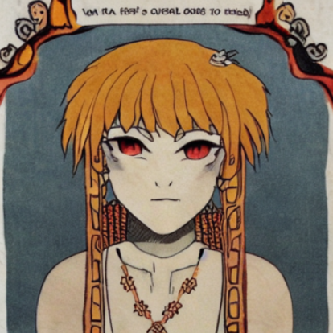
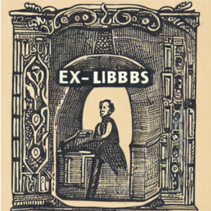
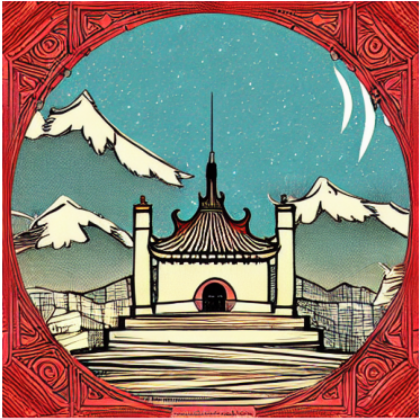
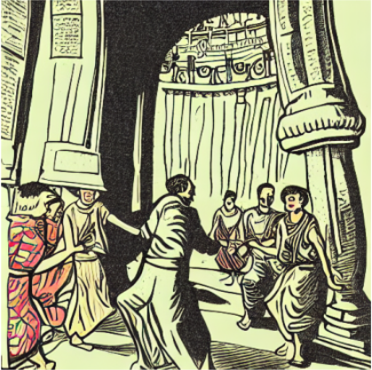
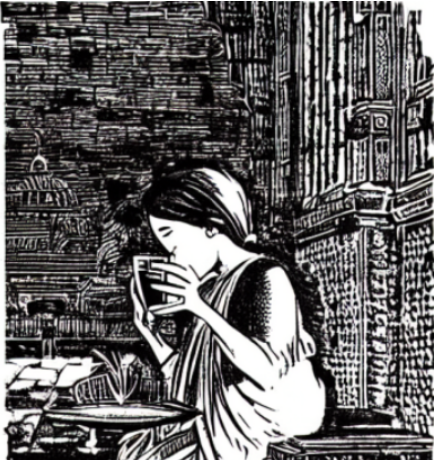
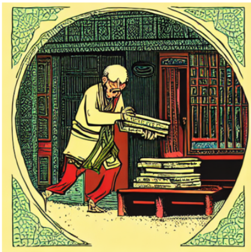

# 🎨 Old Art Style Diffusion Model

This repository contains an **old art–style image generation model** created by fine-tuning sd15 to move away from modern, polished AI aesthetics and toward **aged textures, muted colors, and traditional art characteristics**.


---
## 🔗 Model Link

Model weights are hosted on Kaggle:  
👉 (https://www.kaggle.com/models/adarsh2626/sd15_old_book_style/)

---

## 🧠 Motivation

Most pretrained diffusion models naturally generate clean, sharp, modern-looking images.  
While impressive, they often fail to capture the **imperfect and aged feel** of traditional artwork.

The goal of this project was simple:
> Bias a diffusion model toward an old art style.

---

## 🛠️ Approach

- Fine-tuned sd15 on self made old art–style dataset
- Focused on:
  - Texture aging
  - Muted and desaturated color palettes
  - Traditional art characteristics
---

## 🖼️ Sample Outputs

Below are sample images generated by the model:








These outputs show a consistent tendency toward **aged textures and traditional art aesthetics**, rather than modern digital sharpness.

---

## 🎥 Demo Video

https://youtu.be/O7qbnz9ws5Y?si=MvrNTtkcmzrLFbyr

---

## ⚠️ Limitations

- Style consistency can vary depending on prompts
- **use "old book illustration style" in start of prompt then write the idea to activate lora**
```python
from diffusers import StableDiffusionPipeline
import torch
import matplotlib.pyplot as plt

device = "cuda" if torch.cuda.is_available() else "cpu"

pipe = StableDiffusionPipeline.from_pretrained(
    "/kaggle/input/sd15_old_book_style/pytorch/small_2gb_model/1", #path
    torch_dtype=torch.float16
).to(device)

image = pipe(
    "old book illustration style, old man looting the beautiful temple", #use old book illustration style in start of prompt to activate lora
    num_inference_steps=30,
    guidance_scale=7.5
).images[0]

plt.imshow(image)
plt.axis("off")
plt.show()

#image.save("output.png")   #to save it
```

---

## 📚 What I Learned

- Diffusion models learn **style distributions**, not exact images
- Dataset quality matters more than dataset size
- Schedulers strongly influence training stability
- Debugging generative models requires experimentation, not just theory

---
## Note
-If you used this model or like the art it generate please give this model a upvote on [Kaggle](https://www.kaggle.com/models/adarsh2626/sd15_old_book_style/) this will motivate me to learn and make more🫠🙂


